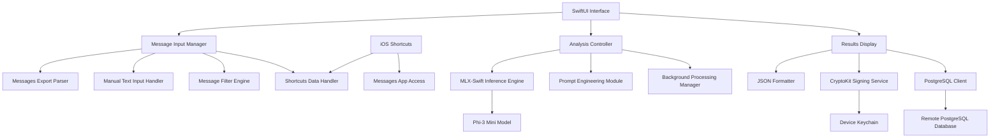

# Design Document

## Overview

The Privacy-Preserving Credit Score Analyzer is a standalone iOS app built with SwiftUI that performs on-device analysis of iMessages to assess personality traits and trustworthiness for credit scoring purposes. The app leverages MLX-Swift for running Phi-3 Mini locally, CryptoKit for cryptographic verification, and PostgresClientKit for backend communication, ensuring that raw message data never leaves the device.

## Project Structure

The project is organized into two main components:

1. **PrivacyCreditAnalyzer Package**: Core data models and business logic (Swift Package)
2. **message-credit iOS App**: SwiftUI interface and app-specific functionality (Xcode project)

```
message-credit/                          # Main iOS app project
├── message-credit.xcodeproj/            # Xcode project file
├── message-credit/                      # App source code
│   ├── message_creditApp.swift          # App entry point
│   ├── ContentView.swift                # Main UI interface
│   └── Assets.xcassets/                 # App assets
├── message-creditTests/                 # App-specific tests
└── message-creditUITests/               # UI tests

PrivacyCreditAnalyzer/                   # Core package (dependency)
├── Sources/PrivacyCreditAnalyzer/       # Core data models
│   └── Models/                          # Data model definitions
├── Tests/PrivacyCreditAnalyzerTests/    # Unit tests for models
└── Package.swift                        # Package configuration
```

## Architecture

### High-Level Architecture



### Core Components

1. **Message Input Layer**: Handles message ingestion from multiple sources
2. **Processing Layer**: Manages AI inference and background processing
3. **Security Layer**: Handles cryptographic operations and verification
4. **Network Layer**: Manages secure communication with backend
5. **UI Layer**: Provides debugging interface and user interaction

## Components and Interfaces

### 1. Message Input Manager

**Purpose**: Centralized handling of message input from various sources

**Key Classes**:
- `MessageInputManager`: Main coordinator for message ingestion
- `MessagesExportParser`: Parses Messages Export JSON files
- `ManualInputHandler`: Processes manually entered text
- `MessageFilterEngine`: Implements intelligent filtering logic
- `ShortcutsDataHandler`: Processes data received from iOS Shortcuts
- `ShortcutInstaller`: Manages Shortcut installation and user guidance

**Interfaces**:
```swift
protocol MessageInputProtocol {
    func parseMessagesExport(from url: URL) async throws -> [Message]
    func parseManualInput(_ text: String) -> [Message]
    func filterMessages(_ messages: [Message], strategy: FilterStrategy) -> [Message]
    func handleShortcutsData(_ data: Data) async throws -> [Message]
}

protocol ShortcutsIntegrationProtocol {
    func installShortcut() async throws -> Bool
    func handleIncomingShortcutData(_ url: URL) async throws -> [Message]
    func validateShortcutData(_ data: Data) throws -> Bool
}

enum FilterStrategy {
    case all
    case lovedOnes
    case financialKeywords
}
```

### 2. MLX-Swift Inference Engine

**Purpose**: On-device AI processing using Phi-3 Mini model

**Key Classes**:
- `MLXInferenceEngine`: Main inference coordinator
- `PromptEngineer`: Crafts prompts for personality and trustworthiness analysis
- `ModelManager`: Handles model loading and memory management
- `BackgroundProcessor`: Manages long-running analysis tasks

**Interfaces**:
```swift
protocol InferenceEngineProtocol {
    func loadModel() async throws
    func analyzePersonality(messages: [Message]) async throws -> PersonalityTraits
    func calculateTrustworthiness(messages: [Message], traits: PersonalityTraits) async throws -> TrustworthinessScore
    func processInBackground(messages: [Message]) async throws -> AnalysisResult
}
```

### 3. Cryptographic Verification Service

**Purpose**: Signs analysis results and manages cryptographic operations

**Key Classes**:
- `CryptoService`: Main cryptographic operations coordinator
- `SigningManager`: Handles JSON signing with CryptoKit
- `HashGenerator`: Creates hashes of inputs and model weights
- `KeychainManager`: Manages private keys securely

**Interfaces**:
```swift
protocol CryptoServiceProtocol {
    func generateKeyPair() throws -> (privateKey: SecKey, publicKey: SecKey)
    func signAnalysisResult(_ result: AnalysisResult, with privateKey: SecKey) throws -> SignedResult
    func hashInputs(messages: [Message], modelWeights: Data) -> String
    func verifySignature(for result: SignedResult, with publicKey: SecKey) -> Bool
}
```

### 4. iOS Shortcuts Integration Layer

**Purpose**: Streamlined message import using iOS Shortcuts for enhanced user experience

**Key Classes**:
- `ShortcutsDataHandler`: Processes incoming data from iOS Shortcuts
- `ShortcutInstaller`: Manages Shortcut installation and user guidance
- `MessageAccessManager`: Handles Messages app data access permissions
- `ShortcutValidator`: Validates and sanitizes Shortcut-provided data

**Interfaces**:
```swift
protocol ShortcutsIntegrationProtocol {
    func installShortcut() async throws -> Bool
    func handleIncomingShortcutData(_ url: URL) async throws -> [Message]
    func validateShortcutData(_ data: Data) throws -> Bool
    func requestMessagesPermission() async throws -> Bool
    func applySampling(to messages: [Message], targetCount: Int) -> [Message]
}

struct ShortcutConfiguration {
    let name: String
    let version: String
    
    // Message Limits
    let maxMessagesPerConversation: Int = 1000
    let maxTotalMessages: Int = 5000
    let maxDataSizeBytes: Int = 10 * 1024 * 1024  // 10MB
    
    // Time Range Options
    let quickAnalysisRange: TimeInterval = 7 * 24 * 60 * 60      // 7 days (~200 messages)
    let standardAnalysisRange: TimeInterval = 30 * 24 * 60 * 60  // 30 days (~1,000 messages)
    let deepAnalysisRange: TimeInterval = 90 * 24 * 60 * 60      // 90 days (~5,000 messages)
    
    // Performance Tiers
    let performanceTiers: [PerformanceTier] = [
        PerformanceTier(name: "Quick", messageLimit: 200, timeRange: quickAnalysisRange),
        PerformanceTier(name: "Standard", messageLimit: 1000, timeRange: standardAnalysisRange),
        PerformanceTier(name: "Deep", messageLimit: 5000, timeRange: deepAnalysisRange)
    ]
}

struct PerformanceTier {
    let name: String
    let messageLimit: Int
    let timeRange: TimeInterval
    let estimatedProcessingTime: TimeInterval
    let recommendedFor: String
}

enum ShortcutDataError: Error {
    case tooManyMessages(count: Int, limit: Int)
    case dataSizeTooLarge(size: Int, limit: Int)
    case timeoutDuringExtraction
    case insufficientPermissions
    case invalidDataFormat
    case samplingRequired(originalCount: Int, targetCount: Int)
}
```

**Shortcut Workflow**:
1. User runs custom iOS Shortcut and selects performance tier (Quick/Standard/Deep)
2. Shortcut requests Messages app access permission
3. User selects conversations and time range based on chosen tier
4. Shortcut applies smart filtering to prioritize financial conversations
5. Shortcut extracts messages with enforced limits (max 1,000 per conversation, 5,000 total)
6. Shortcut validates data size (max 10MB) and applies compression if needed
7. Shortcut formats and shares data with main app via secure URL scheme
8. App receives data, validates limits, and applies sampling if necessary
9. App populates input field and offers immediate analysis with processing time estimate

**Smart Filtering Logic**:
- Prioritize conversations with financial keywords (money, loan, payment, etc.)
- Weight recent messages higher than older ones
- Include conversations with high message frequency (close relationships)
- Sample evenly across time periods if limits are exceeded
- Preserve conversation context by keeping message sequences intact

### 5. PostgreSQL Communication Layer

**Purpose**: Secure communication with backend database

**Key Classes**:
- `DatabaseClient`: PostgresClientKit wrapper
- `ResultUploader`: Handles signed result transmission
- `ConnectionManager`: Manages database connections
- `VerificationService`: Server-side signature verification

**Interfaces**:
```swift
protocol DatabaseClientProtocol {
    func connect() async throws
    func uploadSignedResult(_ result: SignedResult) async throws -> UploadResponse
    func verifyConnection() async throws -> Bool
    func disconnect()
}
```

## Data Models

### Core Data Structures

```swift
struct Message {
    let id: UUID
    let content: String
    let timestamp: Date
    let sender: String
    let recipient: String
    let isFromUser: Bool
}

struct PersonalityTraits {
    let openness: Double
    let conscientiousness: Double
    let extraversion: Double
    let agreeableness: Double
    let neuroticism: Double
    let confidence: Double
}

struct TrustworthinessScore {
    let score: Double // 0.0 to 1.0
    let factors: [String: Double]
    let explanation: String
}

struct AnalysisResult {
    let id: UUID
    let timestamp: Date
    let personalityTraits: PersonalityTraits
    let trustworthinessScore: TrustworthinessScore
    let messageCount: Int
    let processingTime: TimeInterval
}

struct SignedResult {
    let result: AnalysisResult
    let signature: String
    let publicKey: String
    let inputHash: String
    let modelHash: String
}
```

### Database Schema

```sql
CREATE TABLE analysis_results (
    id UUID PRIMARY KEY,
    timestamp TIMESTAMP NOT NULL,
    personality_traits JSONB NOT NULL,
    trustworthiness_score JSONB NOT NULL,
    message_count INTEGER NOT NULL,
    processing_time INTERVAL NOT NULL,
    signature TEXT NOT NULL,
    public_key TEXT NOT NULL,
    input_hash TEXT NOT NULL,
    model_hash TEXT NOT NULL,
    verified BOOLEAN DEFAULT FALSE
);
```

## Error Handling

### Error Categories

1. **Input Errors**: Invalid message format, empty input, corrupted files
2. **Processing Errors**: Model loading failures, inference timeouts, memory issues
3. **Cryptographic Errors**: Key generation failures, signing errors, verification failures
4. **Network Errors**: Connection timeouts, authentication failures, server errors

### Error Handling Strategy

```swift
enum AnalysisError: Error, LocalizedError {
    case invalidInput(String)
    case modelLoadingFailed(String)
    case inferenceTimeout
    case cryptographicFailure(String)
    case networkError(String)
    case backgroundProcessingCancelled
    
    var errorDescription: String? {
        switch self {
        case .invalidInput(let message):
            return "Invalid input: \(message)"
        case .modelLoadingFailed(let reason):
            return "Failed to load AI model: \(reason)"
        case .inferenceTimeout:
            return "Analysis timed out. Try with fewer messages."
        case .cryptographicFailure(let reason):
            return "Security operation failed: \(reason)"
        case .networkError(let reason):
            return "Network error: \(reason)"
        case .backgroundProcessingCancelled:
            return "Background processing was cancelled"
        }
    }
}
```

## Testing Strategy

### Unit Testing

1. **Message Parsing Tests**: Validate Messages Export parsing and manual input handling
2. **Filtering Logic Tests**: Test loved ones detection and keyword filtering
3. **Cryptographic Tests**: Verify signing, verification, and key management
4. **Model Integration Tests**: Test MLX-Swift integration and prompt engineering

### Integration Testing

1. **End-to-End Flow Tests**: Complete analysis pipeline from input to signed output
2. **Background Processing Tests**: Long-running analysis with cancellation
3. **Database Integration Tests**: Upload and verification workflows
4. **Error Handling Tests**: Graceful failure scenarios

### Performance Testing

1. **Memory Usage Tests**: Monitor memory consumption during large message processing
2. **Battery Impact Tests**: Measure power consumption during background processing
3. **Model Loading Tests**: Optimize model initialization time
4. **Network Performance Tests**: Test upload speeds and timeout handling

### Privacy Testing

1. **Data Leakage Tests**: Verify no raw messages are transmitted
2. **Local Storage Tests**: Ensure no sensitive data persists locally
3. **Network Traffic Analysis**: Monitor all outbound communications
4. **Cryptographic Verification Tests**: Validate signature integrity

## iOS Shortcuts Performance and User Experience

### Performance Tiers and Recommendations

**Quick Analysis (200 messages, 7 days)**:
- **Use Case**: Fast daily check-ins, recent financial activity
- **Processing Time**: ~30 seconds
- **Memory Usage**: ~5MB
- **Recommended For**: Users wanting immediate insights

**Standard Analysis (1,000 messages, 30 days)**:
- **Use Case**: Monthly financial behavior assessment
- **Processing Time**: ~2-3 minutes
- **Memory Usage**: ~15-25MB
- **Recommended For**: Regular credit monitoring

**Deep Analysis (5,000 messages, 90 days)**:
- **Use Case**: Comprehensive creditworthiness evaluation
- **Processing Time**: ~5-10 minutes (background processing)
- **Memory Usage**: ~50-75MB
- **Recommended For**: Loan applications, major financial decisions

### Smart Sampling Algorithm

When message counts exceed optimal limits, the system applies intelligent sampling:

```swift
func applySampling(messages: [Message], targetCount: Int) -> [Message] {
    // 1. Prioritize financial conversations (40% weight)
    let financialMessages = messages.filter { containsFinancialKeywords($0.content) }
    
    // 2. Prioritize recent messages (30% weight)
    let recentMessages = messages.sorted { $0.timestamp > $1.timestamp }.prefix(targetCount / 2)
    
    // 3. Ensure conversation diversity (20% weight)
    let diverseConversations = sampleAcrossConversations(messages, targetCount: targetCount / 3)
    
    // 4. Maintain temporal distribution (10% weight)
    let temporalSample = sampleAcrossTimeRange(messages, targetCount: targetCount / 5)
    
    return combineAndDeduplicate([financialMessages, recentMessages, diverseConversations, temporalSample])
        .prefix(targetCount)
}
```

### User Experience Guidelines

**Shortcut Installation Flow**:
1. Show performance tier comparison table
2. Explain message limits and processing times
3. Guide user through iOS Shortcuts app installation
4. Provide step-by-step setup instructions
5. Test connection with small sample

**Error Handling and User Feedback**:
- Clear progress indicators during message extraction
- Helpful error messages with suggested solutions
- Automatic fallback to smaller datasets when limits exceeded
- Option to retry with different parameters

## Implementation Considerations

### Project Architecture

The app follows a modular architecture with clear separation of concerns:

- **PrivacyCreditAnalyzer Package**: Contains all core data models, validation logic, and business rules
- **message-credit App**: Handles UI, user interaction, file management, and app lifecycle
- **Local Package Dependency**: The iOS app imports PrivacyCreditAnalyzer as a local Swift package

### Current Implementation Status

**✅ Completed (Task 1)**:
- Core data models with full validation and serialization
- Comprehensive unit test suite (22 tests, all passing)
- iOS app project with package dependency integration
- Basic UI with mock analysis functionality
- File picker integration (basic implementation)

**🚧 Next Steps**:
- Message parsing functionality (Task 2)
- Real AI inference integration (Task 4)
- Background processing implementation (Task 5)
- Cryptographic signing integration (Task 6)

### MLX-Swift Integration

- Use MLX-Swift's async/await patterns for non-blocking inference
- Implement model quantization for memory efficiency
- Cache model weights hash for signature verification
- Handle model loading failures gracefully with user feedback

### Background Processing

- Leverage iOS BackgroundTasks framework for long-running analysis
- Implement progress reporting and cancellation support
- Use Core Data or similar for temporary state persistence
- Respect system resource constraints and thermal state

### Privacy and Security

- Never persist raw message content beyond analysis session
- Use iOS Keychain for private key storage
- Implement certificate pinning for backend communication
- Provide clear privacy indicators in UI during processing

### User Experience

- ✅ Real-time progress indicators during analysis
- ✅ Comprehensive results display with personality trait visualization
- ✅ Clear error messages with actionable guidance
- ✅ Processing status and timing information for debugging
- 🚧 File import functionality (basic UI implemented, parsing pending)
- 🚧 Offline mode for analysis without backend upload