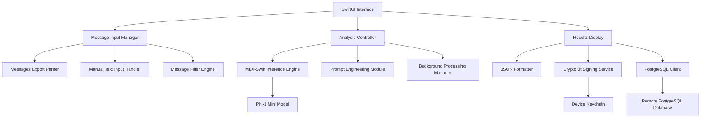

# Design Document

## Overview

The Privacy-Preserving Credit Score Analyzer is a standalone iOS app built with SwiftUI that performs on-device analysis of iMessages to assess personality traits and trustworthiness for credit scoring purposes. The app leverages MLX-Swift for running Phi-3 Mini locally, CryptoKit for cryptographic verification, and PostgresClientKit for backend communication, ensuring that raw message data never leaves the device.

## Architecture

### High-Level Architecture



### Core Components

1. **Message Input Layer**: Handles message ingestion from multiple sources
2. **Processing Layer**: Manages AI inference and background processing
3. **Security Layer**: Handles cryptographic operations and verification
4. **Network Layer**: Manages secure communication with backend
5. **UI Layer**: Provides debugging interface and user interaction

## Components and Interfaces

### 1. Message Input Manager

**Purpose**: Centralized handling of message input from various sources

**Key Classes**:
- `MessageInputManager`: Main coordinator for message ingestion
- `MessagesExportParser`: Parses Messages Export JSON files
- `ManualInputHandler`: Processes manually entered text
- `MessageFilterEngine`: Implements intelligent filtering logic

**Interfaces**:
```swift
protocol MessageInputProtocol {
    func parseMessagesExport(from url: URL) async throws -> [Message]
    func parseManualInput(_ text: String) -> [Message]
    func filterMessages(_ messages: [Message], strategy: FilterStrategy) -> [Message]
}

enum FilterStrategy {
    case all
    case lovedOnes
    case financialKeywords
}
```

### 2. MLX-Swift Inference Engine

**Purpose**: On-device AI processing using Phi-3 Mini model

**Key Classes**:
- `MLXInferenceEngine`: Main inference coordinator
- `PromptEngineer`: Crafts prompts for personality and trustworthiness analysis
- `ModelManager`: Handles model loading and memory management
- `BackgroundProcessor`: Manages long-running analysis tasks

**Interfaces**:
```swift
protocol InferenceEngineProtocol {
    func loadModel() async throws
    func analyzePersonality(messages: [Message]) async throws -> PersonalityTraits
    func calculateTrustworthiness(messages: [Message], traits: PersonalityTraits) async throws -> TrustworthinessScore
    func processInBackground(messages: [Message]) async throws -> AnalysisResult
}
```

### 3. Cryptographic Verification Service

**Purpose**: Signs analysis results and manages cryptographic operations

**Key Classes**:
- `CryptoService`: Main cryptographic operations coordinator
- `SigningManager`: Handles JSON signing with CryptoKit
- `HashGenerator`: Creates hashes of inputs and model weights
- `KeychainManager`: Manages private keys securely

**Interfaces**:
```swift
protocol CryptoServiceProtocol {
    func generateKeyPair() throws -> (privateKey: SecKey, publicKey: SecKey)
    func signAnalysisResult(_ result: AnalysisResult, with privateKey: SecKey) throws -> SignedResult
    func hashInputs(messages: [Message], modelWeights: Data) -> String
    func verifySignature(for result: SignedResult, with publicKey: SecKey) -> Bool
}
```

### 4. PostgreSQL Communication Layer

**Purpose**: Secure communication with backend database

**Key Classes**:
- `DatabaseClient`: PostgresClientKit wrapper
- `ResultUploader`: Handles signed result transmission
- `ConnectionManager`: Manages database connections
- `VerificationService`: Server-side signature verification

**Interfaces**:
```swift
protocol DatabaseClientProtocol {
    func connect() async throws
    func uploadSignedResult(_ result: SignedResult) async throws -> UploadResponse
    func verifyConnection() async throws -> Bool
    func disconnect()
}
```

## Data Models

### Core Data Structures

```swift
struct Message {
    let id: UUID
    let content: String
    let timestamp: Date
    let sender: String
    let recipient: String
    let isFromUser: Bool
}

struct PersonalityTraits {
    let openness: Double
    let conscientiousness: Double
    let extraversion: Double
    let agreeableness: Double
    let neuroticism: Double
    let confidence: Double
}

struct TrustworthinessScore {
    let score: Double // 0.0 to 1.0
    let factors: [String: Double]
    let explanation: String
}

struct AnalysisResult {
    let id: UUID
    let timestamp: Date
    let personalityTraits: PersonalityTraits
    let trustworthinessScore: TrustworthinessScore
    let messageCount: Int
    let processingTime: TimeInterval
}

struct SignedResult {
    let result: AnalysisResult
    let signature: String
    let publicKey: String
    let inputHash: String
    let modelHash: String
}
```

### Database Schema

```sql
CREATE TABLE analysis_results (
    id UUID PRIMARY KEY,
    timestamp TIMESTAMP NOT NULL,
    personality_traits JSONB NOT NULL,
    trustworthiness_score JSONB NOT NULL,
    message_count INTEGER NOT NULL,
    processing_time INTERVAL NOT NULL,
    signature TEXT NOT NULL,
    public_key TEXT NOT NULL,
    input_hash TEXT NOT NULL,
    model_hash TEXT NOT NULL,
    verified BOOLEAN DEFAULT FALSE
);
```

## Error Handling

### Error Categories

1. **Input Errors**: Invalid message format, empty input, corrupted files
2. **Processing Errors**: Model loading failures, inference timeouts, memory issues
3. **Cryptographic Errors**: Key generation failures, signing errors, verification failures
4. **Network Errors**: Connection timeouts, authentication failures, server errors

### Error Handling Strategy

```swift
enum AnalysisError: Error, LocalizedError {
    case invalidInput(String)
    case modelLoadingFailed(String)
    case inferenceTimeout
    case cryptographicFailure(String)
    case networkError(String)
    case backgroundProcessingCancelled
    
    var errorDescription: String? {
        switch self {
        case .invalidInput(let message):
            return "Invalid input: \(message)"
        case .modelLoadingFailed(let reason):
            return "Failed to load AI model: \(reason)"
        case .inferenceTimeout:
            return "Analysis timed out. Try with fewer messages."
        case .cryptographicFailure(let reason):
            return "Security operation failed: \(reason)"
        case .networkError(let reason):
            return "Network error: \(reason)"
        case .backgroundProcessingCancelled:
            return "Background processing was cancelled"
        }
    }
}
```

## Testing Strategy

### Unit Testing

1. **Message Parsing Tests**: Validate Messages Export parsing and manual input handling
2. **Filtering Logic Tests**: Test loved ones detection and keyword filtering
3. **Cryptographic Tests**: Verify signing, verification, and key management
4. **Model Integration Tests**: Test MLX-Swift integration and prompt engineering

### Integration Testing

1. **End-to-End Flow Tests**: Complete analysis pipeline from input to signed output
2. **Background Processing Tests**: Long-running analysis with cancellation
3. **Database Integration Tests**: Upload and verification workflows
4. **Error Handling Tests**: Graceful failure scenarios

### Performance Testing

1. **Memory Usage Tests**: Monitor memory consumption during large message processing
2. **Battery Impact Tests**: Measure power consumption during background processing
3. **Model Loading Tests**: Optimize model initialization time
4. **Network Performance Tests**: Test upload speeds and timeout handling

### Privacy Testing

1. **Data Leakage Tests**: Verify no raw messages are transmitted
2. **Local Storage Tests**: Ensure no sensitive data persists locally
3. **Network Traffic Analysis**: Monitor all outbound communications
4. **Cryptographic Verification Tests**: Validate signature integrity

## Implementation Considerations

### MLX-Swift Integration

- Use MLX-Swift's async/await patterns for non-blocking inference
- Implement model quantization for memory efficiency
- Cache model weights hash for signature verification
- Handle model loading failures gracefully with user feedback

### Background Processing

- Leverage iOS BackgroundTasks framework for long-running analysis
- Implement progress reporting and cancellation support
- Use Core Data or similar for temporary state persistence
- Respect system resource constraints and thermal state

### Privacy and Security

- Never persist raw message content beyond analysis session
- Use iOS Keychain for private key storage
- Implement certificate pinning for backend communication
- Provide clear privacy indicators in UI during processing

### User Experience

- Show real-time progress for background processing
- Provide clear error messages with actionable guidance
- Implement offline mode for analysis without backend upload
- Display processing status and timing information for debugging